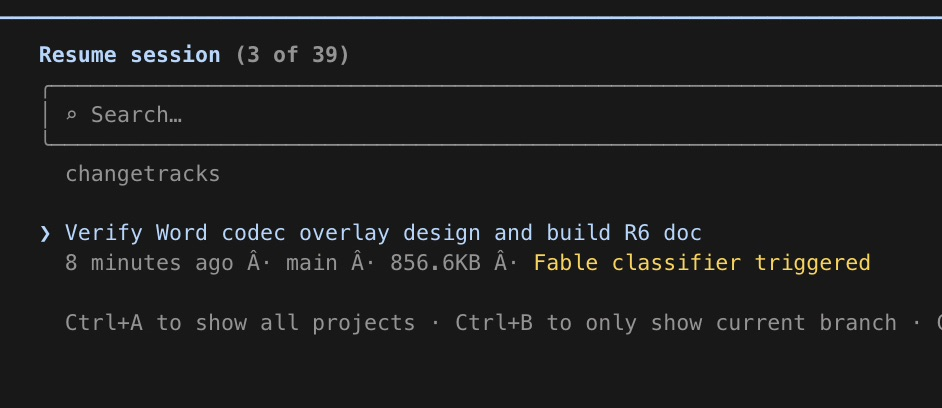

# FableTriggered - Claude Code Fable downgrade message visibility patch

## What is this?

An instruction file that tells a coding agent how to monkey-patch a local version of Claude Code to show an indicator in the session `/resume` list if the session had a security-classifier downgrade message, and then to unhide that downgrade message in the resumed chat.

## Why would I want this?

The safety classifiers for Fable from Anthropic are quite hyperactive (even before the predictable but deeply unfortunate US government intervention), and you will likely get downgraded to Opus frequently. When this happens, it's visible mid-session to the user, but the Claude Code harness currently hides it on resume, providing no indicator a session was part Fable, part Opus.

This seems less than ideal for a variety of practical and/or ideological reasons that you can probably imagine for yourself.

## How does it work?

You point your preferred local coding agent at the instruction file. The actual refusal message is in the transcript history, it's just not rendered by the Claude Code harness by default. Implementation work tested with Codex; likely would be refused by Claude itself.

## Patch instruction files

- [`claude-fable-fallback-patch.md`](claude-fable-fallback-patch.md) - shows Fable fallback events in resumed history and `/resume`.
- [`claude-reminder-suppression-patch.md`](claude-reminder-suppression-patch.md) - suppresses selected recurring reminder attachments in a copied Claude Code binary.

## ClaudeMonkey packages

- [`packages/fable-fallback`](packages/fable-fallback) - graph-repack package for Fable fallback visibility and `/resume` marking.
- [`packages/hidden-context-drawer`](packages/hidden-context-drawer) - graph-repack package that adds the footer Hidden Context drawer for model-visible hidden attachment context.
- [`packages/normal-channel-hidden-context`](packages/normal-channel-hidden-context) - graph-repack package that projects selected hidden model-visible attachment context into the normal transcript as warning rows.
- [`packages/reminder-suppression`](packages/reminder-suppression) - graph-repack package for suppressing selected recurring reminder renderers.

## Is this a good idea?

Maybe not? Hard to say. Maybe Anthropic will chime in.

It's just a small bit of JavaScript patching into the resume metadata and message display. I tried to include some sanity about installing it, but this will surely be brittle with updates. So, idk, rerun with your agent if it breaks and watch memory leaks maybe?

No warranty; have fun, don't die, etc. etc.

<3 Hackerbara
