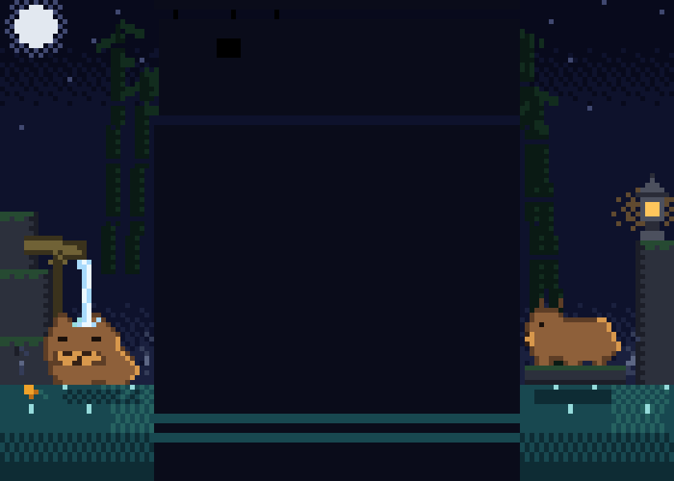

# Capybara Onsen

A calming twilight Japanese hot spring flanks the Claude Code terminal — high-def
half-block pixel art. On the left, a capybara soaks to its chin while a thin
clear-blue stream from a bamboo kakei spout pours gently onto its head. On the
right, a second capybara rests on a rock shelf under the amber glow of a stone
lantern, flicking its ears every few seconds. Steam drifts off the water.



## What it does

- Renders **two independent walls** (no mirroring — it's one continuous scene) in
  the 32-cell gutters: moon, stars, bamboo leaning inward, stepped mossy rocks,
  kakei spout + soaking capybara + floating yuzu (left); stone lantern with a
  warm dithered halo + resting capybara (right).
- **Animated regions** (bottom 22 cell rows only): the spout stream with
  descending pulses and impact spray, an expanding pool ripple, rising steam
  wisps, and the resting capybara's occasional double ear-flick.
- Continues the pool water into the composer flanks so the bath reaches the very
  bottom corners; the bottom chrome parent is tinted deep indigo `rgb(10,12,26)`.

## How it works (rendering)

Same skeleton as `hotrod-dragons`: pre-baked art drawn through the bundled
renderer's native `ink-raw-ansi` direct-draw node (`▀` half-blocks, fg=top /
bg=bottom subpixel → 2× vertical resolution, truecolor per subpixel). ANSI
strings are assembled once at module eval; per 180 ms tick only the two
animated-band strings swap (16 phases; water cycles at 8, the ear flick occupies
3 of 16 phases so the scene is still ~2.3 s between flicks).

Deliberate differences from the dragons:

- **Two authored walls** instead of left + runtime mirror (the scene is
  asymmetric).
- **Animated band at the BOTTOM** + `justifyContent:"flex-end"` containers: on
  short terminals the *sky* clips first — the capybaras and all motion survive
  any height.
- **180 ms tick** instead of 95 ms — calm cadence, fewer redraws.

Shared discipline:

- **Mojibake-safe**: payloads contain no literal `▀` or ESC bytes — both are
  produced at runtime via `String.fromCharCode(9600)` / `(27)`. Art data is
  embedded as numeric RLE run arrays.
- **Truecolor primary; 256-color fallback** via a 6×6×6 cube map at runtime.
- Static band is byte-identical across all 16 phases (asserted at compile time).

## Target

- Claude Code **2.1.199**, `darwin/arm64` (Bun standalone macho64).
- Module: `/$bunfs/root/src/entrypoints/cli.js`.
- Pinned by whole-binary SHA-256, whole-module SHA-256/length, and per-operation
  old-range SHA-256/length.

## Operations (seams)

All five are `replace_exact` inserts/replacements (non-overlapping), at the same
anchors as `hotrod-dragons` — the two packages are **mutually exclusive**; the
builder's byte-range overlap check rejects co-application:

1. `…-scene-helpers-before-v8o` — scene components + baked art data.
2. `…-fullscreen-scene-pe` — mounts the walls in the fullscreen conversation view.
3. `…-composer-flank-ue` — pool water into the composer flanks.
4. `…-composer-parent-le` — indigo background on the bottom chrome parent.
5. `…-fallback-scene-v` — mounts the walls in the non-fullscreen fallback path.

## Build pipeline

Art sources live in `.development/capy-onsen-20260703/`: `paint_scene.py`
(hand-authored masks + preview PNGs), `water_sim.py` (deterministic phase
animation, no `random`), `compile.py` (RLE + palette → `onsen-data.json`, with
determinism and static-band asserts), `generate_package.py` (emits this package
from the pinned live source).

```bash
cd /Users/MAC/Documents/Claude-patch
PYTHONPATH=src python3 -m claude_monkey build \
  --source /Users/MAC/.local/share/claude/versions/2.1.199 \
  --package packages/capybara-onsen \
  --output-dir .development/claude-monkey-builds/capybara-onsen \
  --source-version 2.1.199 \
  --source-version-output "2.1.199 (Claude Code)" \
  --platform darwin --arch arm64
```

## Manual smoke

`manualSmoke.required = true`. Purely visual TUI art — automated sign/smoke gates
pass, but activation is gated on interactive confirmation in a truecolor
terminal (Ghostty/iTerm2/WezTerm/kitty/alacritty). Report `status` will be
`manual_smoke_pending` with `automatedStatus: passed`.
